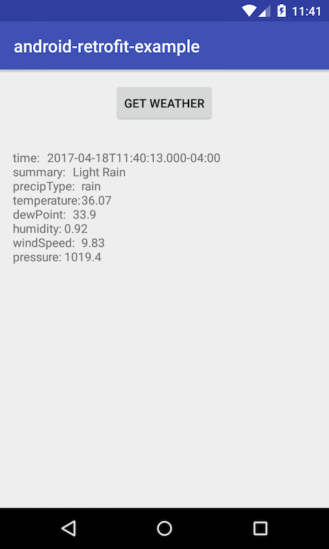

Android + Retrofit 2 + EventBus - example
================================================
Here is an example of usage [Retrofit 2](http://square.github.io/retrofit/) and [EventBus](http://greenrobot.org/eventbus/). Moreover project based on nice binding library [Butter Knife](http://jakewharton.github.io/butterknife/).

Goals
--------
The example application has the following goals:

- Support for API REST Web Service using Retrofit 2 library
- Support for event notification using Event Bus library
- Bind Retrofit 2 with Event Bus, for performing HTTP request and handle event with result.

Screen
---------

